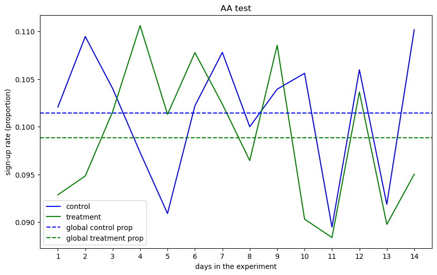
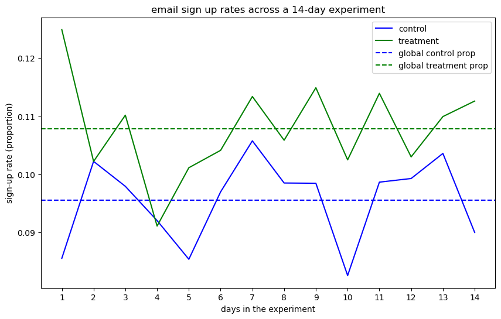

# **Sign-up Rates A/B Testing**

## Business Problem
The team is considering changing the color of the email sign-up button on the website's launch-page to potentially increase sign-up rates. The hypothesis is that the new colour may positively impact user engagement. To validate this, the product manager is proposing an A/B test to determine whether the colour change leads to a meaningful improvement and is the right move to implement.

---

## **Table of Contents**
- [Hypothesis](#Hypothesis)
- [Executive Summary](#executive-summary)
- [Insights Deep Dive](#insights-deep-dive)
- [Recommendations](#recommendations)

---

## Hypothesis

### Null Hypothesis (H₀)
There is no statistically significant difference in email sign-up rates between the green (treatment) and blue (control) buttons.

### Alternative Hypothesis (H₁)
There is a statistically significant difference in email sign-up rates between the green and blue buttons — meaning that changing the button colour may increase or decrease sign-up rates.

---

## **Executive Summary**

### **Key Findings**
The A/B test reveals that the button colour does have an impact of the launc-page sing-up rates.

- The results showed a **12.8% relative lift** in the sign-up rate for the green button compared to the baseline of 9.6%. This improvement was **statistically significant** with a **p-value of < 0.05** and a **95% confidence interval ranging from 5.7% to 19.9%**.

- Given the presence of both statistical and practical significance, we recommend rolling out the green submit button as the new default.

---

## **Insights Deep Dive**

### **Chi-Squared Test Insights: A/A**

-------- AA Test (2021-12-18 - 2021-12-31)---------

Ho: The sign-up rates between blue and green are the same.

Ha: The sign-up rates between blue and green are different.

Significance level: 0.05

Chi-Square = 0.577 | P-value = 0.448

Conclusion:

Fail to reject Ho. Therefore, proceed with the AB test.

### **Sample Ratio Mismatch (SRM)**

------- A Chi-Square Test for SRM --------

Ho: The ratio of samples is 1:1.

Ha: The ratio of samples is not 1:1.

Significance level: 0.05

Chi-Square = 1.290 | P-value = 0.256

Conclusion:

Fail to reject Ho. Therefore, there is no SRM.

### **Z-Test Insights: A/B**

-------- AB Test Email Sign-Ups (2022-02-01 - 2022-02-14)---------

Ho: The sign-up rates between blue and green are the same.

Ha: The sign-up rates between blue and green are different.

Significance level: 0.05

Z-Statistic = 3.509 | P-value = 0.000

Conclusion:

Reject Ho and conclude that there is statistical significance in the difference of sign-up rates between blue and green buttons.

---

## **Recommendations**

In the email sign-up experiment for the Site ABC pre-launch page, we tested whether changing the submit button color from blue to green could improve sign-up rates.

We conducted a two-week randomized controlled trial (February 1–14, 2022), assigning users to either the control group (blue button) or the treatment group (green button).

The results showed a **12.8% relative lift** in the sign-up rate for the green button compared to the baseline of 9.6%. This improvement was **statistically significant** with a **p-value of < 0.05** and a **95% confidence interval ranging from 5.7% to 19.9%**.

Given the presence of both statistical and practical significance, we recommend rolling out the green submit button as the new default.

🚀 *Empowering business decisions through A/B testing.*

